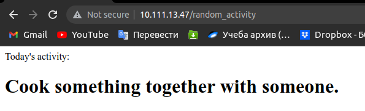

# Описание проекта

Проект состоит из двух сервисов:
- `nginx`: cлужит как прокси и передает запрос второму сервису
- `random-activity-service`: легкий API на фласке который делает запрос на внешний сервис `www.boredapi.com` через `egress`, чтобы получить произвольное действие из большой базы и выводит это на экран как в данном скриншоте:

# Запуск проекта:
- при необходимости (для создания кластера локально) запустите команду: <code>$ minikube start --driver=docker --memory=4096</code>
- зайдите в папку `kube/` и запустите `./run.sh`
- во время исполнения, скрипт попросит ввести пароль пользователя для создания тоннеля на `minikube`
- откройте новое окно терминала в том же директории и запустите команду <code>$ kubectl get service istio-ingressgateway -n istio-system</code> и скопируйте IP из колонки `EXTERNAL-IP`
- чтобы сделать запрос к сервису нужно ввести URL `<EXTERNAL-IP>/random_activity` в браузере и получить результат подобный скриншоту из примера, если все правильно работает
- чтобы почистить кластер локально можно в терминале из папки `kube/` запустить `./clear_all.sh` и при необходимости ввести `$ minikube delete`.