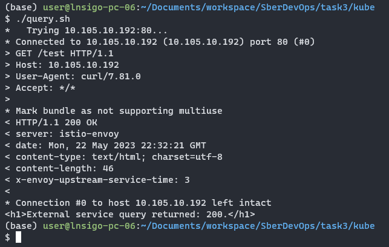

# Запуск проекта:
- при необходимости (для создания кластера локально) запустите команду: <code>$ minikube start --driver=docker --memory=4096</code>
- зайдите в папку `kube/` и запустите `./create_ca.sh` для генерации нужных сертификатов и секрета на их основе
- запустите `./run.sh` чтобы собрать проект и запустить кластер
- во время исполнения, скрипт попросит ввести пароль пользователя для создания тоннеля на `minikube`
- чтобы сделать запрос к сервису, откройте новое окно терминала в той же директории и запустите скрипт `./query.sh`
- в случае успеха вы сможете увидеть результат как на скриншоте снизу, а если получите код HTTP/ 503, то скорее всего ингресс не успел подняться и нужно подождать и сделать запрос снова
- чтобы почистить кластер локально можно в терминале из папки `kube/` запустите `./clear_all.sh` и при необходимости введите `$ minikube delete`.

